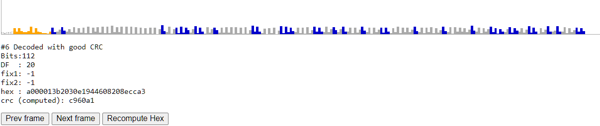

# Dump1090

A simple **ADS-B** (*Automatic Dependent Surveillance - Broadcast*) receiver, decoder and web-server.<br>
It requires a RTLSDR USB-stick and Osmocom's **[librtlsdr](https://github.com/osmocom/rtl-sdr)**.

This *Mode S* decoder is based on the original *Dump1090* by **Salvatore Sanfilippo**
which is **[here](https://github.com/antirez/dump1090.git)**.<br>
Most of the text below is written by him. In this `README.md` file, I've mostly fixed the MarkDown
and added some more references and screen-shots. But in the source-code I've done a lot of changes.

**ADS-B** basics:
 * A YouTube **[video](https://www.youtube.com/watch?v=BDLFHdq540g&ab_channel=AP47TV)**
   explaining it's basics and motivation.
 * A detailed technical description by professor **[Junzi Sun](https://mode-s.org/decode/)**.
 * Or as a **[PDF](The-1090MHz-riddle.pdf)** in this repo.

**The main features** of *Dump1090* are:

* Robust decoding of weak messages, with *Dump1090* many users observed
  improved range compared to other popular decoders.
* Network support: *TCP* port 30003 stream (*MSG5* ...), Raw packets and HTTP.
* An embedded **[Mongoose](https://www.cesanta.com/)** HTTP server that displays
  the currently detected aircrafts on an OpenStreet Map.<br>
  Hopefully WebSocket support is coming soon (JScript and Json transfer is rather chatty).
* Single bit errors correction using the 24 bit CRC.
* Ability to decode *DF11*, *DF17* messages (**Downlink Format**).
* Ability to decode formats like *DF0*, *DF4*, *DF5*, *DF16*, *DF20* and *DF21*
  where the checksum is *XORed* with the ICAO address by brute forcing the
  checksum field using recently seen ICAO addresses.
* Decode raw IQ samples from file (using the `--infile bin-file` command line option).
* Interactive command-line-interface mode where aircrafts currently detected
  are shown as a list refreshing as more data arrives. Planes that haven't been seen
  last 60 seconds are removed from the list (option `--interactive-ttl sec` to change).
* *CPR* (**Compact Position Reporting**) coordinates decoding and track calculation from velocity.
* TCP server streaming and receiving raw data to/from connected clients <br>
  (options `--net` or `--net-only`).

While from time to time I still add / fix stuff in my fork, I target
minimalism in this implementation. <br>
However there is a [much more feature complete fork](https://github.com/MalcolmRobb/dump1090)
available, developed by **Malcolm Robb**.

## Building

  On Windows, type `make -f Makefile.Windows CC=cl` (or `CC=clang-cl`).<br>

## Normal usage

To capture traffic directly from your RTLSDR device (and soon a *SDRPlay* radio) and
show the captured traffic on standard output, just run the program without options at all:
  ```
  dump1090
  ```

  Example output:
  ```
  Tuned to 1090.000 MHz. Gain reported by device: AUTO.
  *8d479e84580fd03d66d139c1cd17;
  CRC: c1cd17 (ok)
  DF 17: ADS-B message.
    Capability     : 5 (Level 2+3+4 (DF0,4,5,11,20,21,24,code7 - is on airborne))
    ICAO Address   : 479e84
    Extended Squitter  Type: 11
    Extended Squitter  Sub : 0
    Extended Squitter  Name: Airborne Position (Baro Altitude)
      F flag   : even
      T flag   : non-UTC
      Altitude : 2125 feet
      Latitude : 7859 (not decoded)
      Longitude: 53561 (not decoded)
  ...
  ```

To only output hexadecimal messages:
  ```
   dump1090 --raw
  ```
  Example output:
  ```
  Tuned to 1090.000 MHz. Gain reported by device: AUTO.
  *8d47c1abea040830015c087c6a4b;
  *8d479e84990c5607200c8319b311;
  *8d479e84580fd04278cda6bd6d32;
  ...
  ```

To run the program in interactive mode:
    ```
    dump1090 --interactive
    ```

To run the program in interactive mode, with networking support and connecting
to your browser to **http://localhost:8080**, use this command:
  ```
  dump1090 --interactive --net
  ```

  It will present live traffic to the Web-browser and console:
  ****

In this interactive mode there is a more compact output. Where the screen is refreshed
up to 4 times per second displaying all the recently seen aircrafts with some additional
information such as flight number, altitude, speed, heading and position. All items extracted
from the received *Mode S* packets. Except the above *RSSI*, *Msgs* and last *Seen*.

## Using files as source of data

To decode data from file, use:
    ```
    dump1090 --infile /path/to/binfile
    ```

The binary file should be created using `rtl_sdr` like this (or with another
program that is able to output 8-bit unsigned IQ samples at 2 MHz sample rate):
  ```
  rtl_sdr -f 1090M -s 2000000 output.bin
  ```

In the above example, `rtl_sdr` with AUTO gain is used. Use `rtl_sdr -g 50` for a 50 dB gain.
A need to experiment with the gain depends on the tuner. But in my expirence, AUTO gain
works best (`--gain 0`).

This is not needed when calling *Dump1090* itself.

It is possible to feed the program with data via *standard input* using
the `--infile` option with `-` as argument.

## Additional options

*Dump1090* can be used with other command line options to set a different
gain, frequency, and so forth. <br>
Full list of options use is shown using `dump1090 --help` or `dump1090 -h`.

A syntax like `dump1090 --freq 1090.001M` is possible for cheap RTLSDR devices with
high frequency drift. But for most devices, this is not needed (due to the
*capture effect* of the signal itself?).

Everything is not documented here ... obviously. For most users running
`dump1090 --interactive` is probably best thing to do.

## Reliability

By default *Dump1090* tries to fix single bit errors using the checksum.
Basically the program will try to flip every bit of the message and check if
the checksum of the resulting message matches.

This is indeed able to fix errors and works reliably in my experience,
however if you are interested in very reliable data, I suggest to use
the `--no-fix` command line switch in order to disable error fixing.

## Performances and detection

In my limited experience *Dump1090* was able to decode a large number of messages
even in conditions where I encountered problems using other programs. However
no formal test was performed so I can't really claim that this program is
better or worse compared to other similar programs.

If you can capture traffic that *Dump1090* is not able to decode properly, drop
me an email with a download link. I may try to improve the detection during
my free time (this is just an hobby project).

## Network server features

By enabling the networking support with `--net`, `dump1090` starts listening
for clients connections on port 30002 and 30001 (you can change both ports
`--net-X-port Y`. See `--help` or `-h` for details).

  * **Port 30002** connected clients are served with data ASAP as they arrive from the device
    (or from file if `--infile` is used) in the raw format similar to the following: <br>
    `*8D451E8B99019699C00B0A81F36E;` <br>
    Every entry is separated by a simple newline (LF character, hex `0x0A`).

  * **Port 30001** is the raw input port, and can be used to feed `dump1090` with
    data in the same format as specified above, with hex messages starting with `*` and
    ending with a `;` character. <br>

So for instance if there is another remote *Dump1090* instance collecting data
it is possible to sum the output to a local *Dump1090* instance with the help of
NetCat or NCat:<br>
   `nc remote-dump1090.example.net 30002 | nc localhost 30001`

It is important to note that what is received via port 30001 is also
broadcasted to clients listening to port 30002.

In general everything received from port 30001 is handled exactly like the
normal traffic from RTL devices or from file when `--infile` is used.

If your feed *Dump1090* with data from the internet, one can use this command to
see on the console what's happening: <br>
    ```
    dump1090 --net-only --interactive
    ```

  * **Port 30003** connected clients are served with messages in
    **[SBS1 (BaseStation) format](http://woodair.net/sbs/article/barebones42_socket_data.htm)**, similar to: <br>
    ```
    MSG,4,,,738065,,,,,,,,420,179,,,0,,0,0,0,0
    MSG,3,,,738065,,,,,,,35000,,,34.81609,34.07810,,,0,0,0,0
    ```
    This can be used to feed data to various sharing sites without the need to use another decoder.

## Antenna

*Mode S* messages are transmitted on the standard frequency of 1090 MHz. If you have a decent
antenna you'll be able to pick up signals from aircrafts pretty far from your
position, especially if you are outdoor and in a position with a good sky view.

You can easily build a very cheap antenna following these **[instructions](http://antirez.com/news/46)**.
With this trivial antenna I was able to pick up signals of aircrafts 200+ Km away from me.

If you are interested in a more serious antenna or ADS-B equipment, check the following resources:

  *  **[GnuRadio Mode-S/ADS-B](https://github.com/bistromath/gr-air-modes)**.
  *  **[Simple ADSB J-pole antenna](http://www.lll.lu/~edward/edward/adsb/antenna/ADSBantenna.html)**.
  *  **[ADS-B / MLAT](https://ieeexplore.ieee.org/document/9129436)**.
       Multilateration; using a *Time Difference of Arrival* (TDOA) calculation
       based on signals from several receivers (probably not cheap RTLSDRs).


## Aggressive mode

With `--aggressive` it is possible to activate the *aggressive mode* that is a
modified version of the *Mode S* packet detection and decoding. The aggresive mode uses
more CPU usually (especially if there are many planes sending *DF17* packets), but
can detect a few more messages.

The algorithm in aggressive mode is modified in the following ways:

* Up to two demodulation errors are tolerated (adjacent entires in the magnitude
  vector with the same eight). Normally only messages without errors are
  checked.
* It tries to fix *DF17* messages trying every two bits combination.

The use of aggressive mode is only advised in places where there is low traffic
in order to have a chance to capture some more messages.

## Debug mode

The Debug mode is a visual help to improve the detection algorithm or to
understand why the program is not working for a given input.

In this mode messages are displayed in an ASCII-art style graphical
representation, where the individial magnitude bars sampled at 2 MHz are
displayed.

An index shows the sample number, where 0 is the sample where the first
*Mode S* peak was found. Some additional background noise is also shown
before the first peak to provide some context.

To enable debug mode and check what combinations of packets you can
log, use `dump1090 --help` to obtain a list of available debug flags.

Debug mode includes an optional JavaScript output (`frames.js`) that is
used to visualize packets using a web browser, you can use
**[tools/debug.html](tools/debug.html)** to load and analyze the generated
`frames.js` file:  .

## How this program works?

The code is very documented and written in order to be easy to understand.
For the diligent programmer with a *Mode S*<br>
specification at hand, it should be trivial to understand how it works.

The algorithms I used were obtained basically looking at many messages
as displayed using a throw-away SDL program, and trying to model the algorithm
based on how the messages look graphically.

## How to test the program?

If you have an RTLSDR device and you happen to be in an area where there
are aircrafts flying over your head, just run the program and check for signals.

If however you don't have an RTLSDR device, or if in your area the presence
of aircrafts is very limited, you may want to try it with the sample file under
the **[testfiles](testfiles/)** directory. Run it like this: <br>
  ```
  dump1090 <other-options> --ifile testfiles/modes1.bin
  ```

## What is `--strip` mode?

A simple filter that will take raw 8-bit IQ samples on input and output a file
missing the I/Q parts that were below the specified `--strip level`. And if
those I/Q samples were below limit for at least 32 samples. <br>
Can be used like: `type big.bin | dump1090 --strip 25 > small.bin`

The `--strip` mode was used to create e.g. **[testfiles/modes1.bin](testfiles/modes1.bin)**.

## Contributing

*Dump1090* was written during some free time during xmas 2012, it is an hobby
project so I'll be able to address issues and improve it only during
free time, however you are incouraged to send pull requests in order to
improve the program. A good starting point can be the TODO list included in
the source distribution.

## Credits

*Dump1090* was written by **[Salvatore Sanfilippo](<antirez@gmail.com>)** and is
released under the BSD three clause license.
