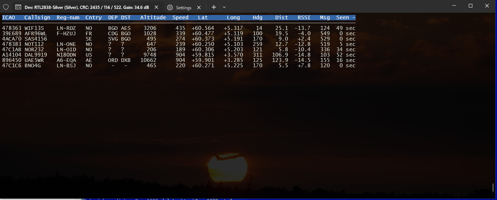
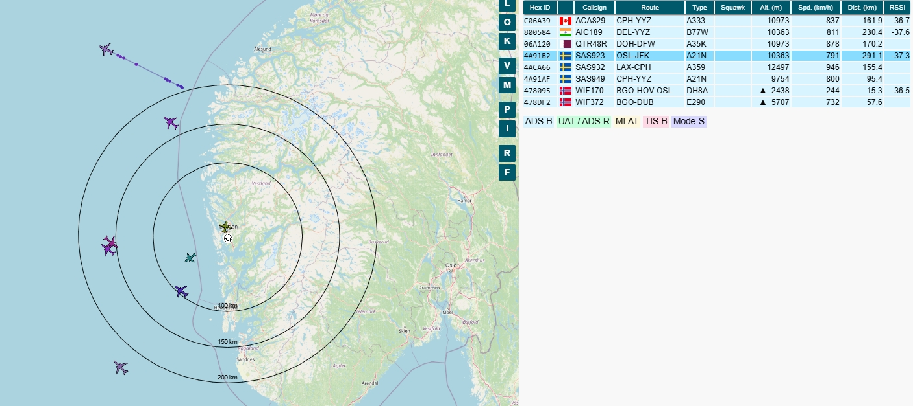
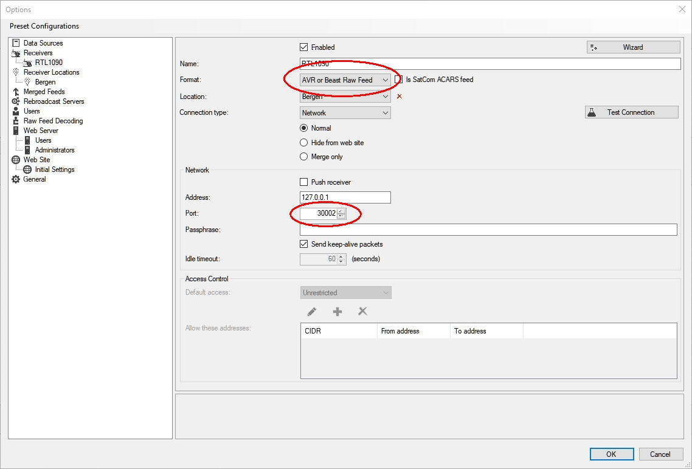
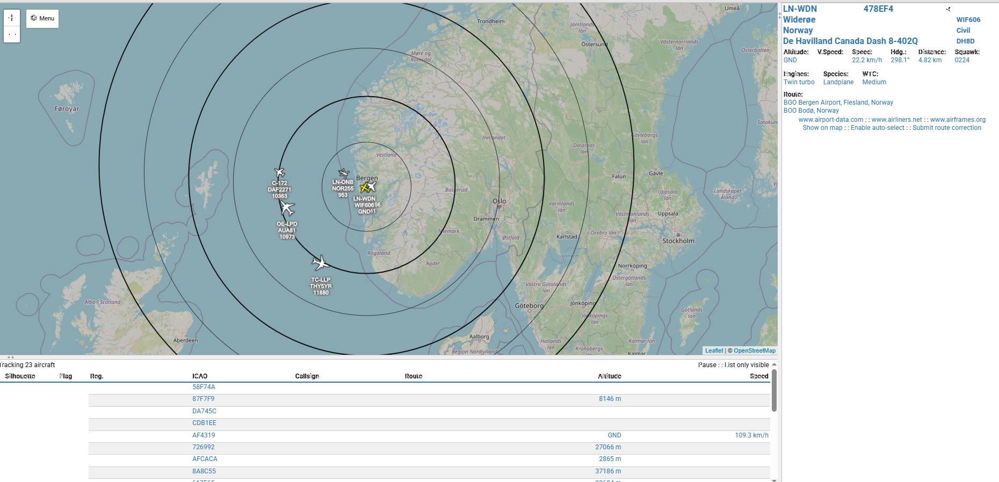
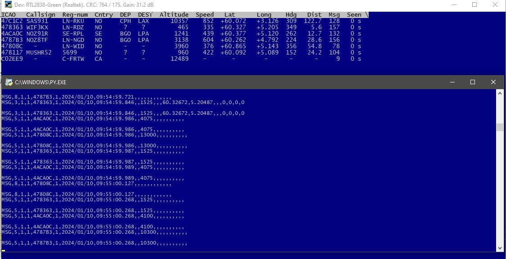

# Dump1090

[](https://github.com/gvanem/Dump1090/actions/workflows/msbuild.yml)
[](https://ci.appveyor.com/project/gvanem/Dump1090)

A simple **ADS-B** (*Automatic Dependent Surveillance - Broadcast*) receiver, decoder and web-server.<nl>
It requires a RTL-SDR USB-stick (the **librtlsdr** interface is **[built-in](src/externals/rtl-sdr/)**).

This *Mode S* decoder is based on the original *Dump1090* by **Salvatore Sanfilippo**
which is **[here](https://github.com/antirez/dump1090.git)**.<nl>
Most of the text below is written by him. In this `README.md` file, I've mostly fixed the MarkDown
and added some more references and screen-shots. But in the source-code I've done a lot of changes.

**ADS-B** basics:
 * A YouTube **[video](https://www.youtube.com/watch?v=BDLFHdq540g&ab_channel=AP47TV)**
   explaining it's basics and motivation.
 * A detailed technical description by professor **[Junzi Sun](https://mode-s.org/decode/)**.
 * Or as a **[PDF](docs/The-1090MHz-riddle.pdf)** in this repo.

**The main features** of *Dump1090* are:

* Robust decoding of weak messages, with *Dump1090* many users observed
  improved range compared to other popular decoders.
* Network support: *TCP* port 30003 stream (*MSG5* ...), Raw packets and HTTP.
* An embedded **[Mongoose](https://www.cesanta.com/)** HTTP server that displays
  the currently detected aircrafts on an OpenStreet Map.<nl>
  Hopefully WebSocket support is coming soon (JScript and Json transfer is rather chatty).
* Decoders for 2.0 MS/s, 2.4 MS/s (default) and 8 MS/s are built-in. 8 MS/s is for [**SDRPlay**](https://www.sdrplay.com/) only.
* Single and two bit errors correction using the 24 bit CRC.
* Ability to decode *DF11*, *DF17* messages (**Downlink Format**).
* Ability to decode formats like *DF0*, *DF4*, *DF5*, *DF16*, *DF20* and *DF21*
  where the checksum is *XORed* with the ICAO address by brute forcing the
  checksum field using recently seen ICAO addresses.
* Decode raw IQ samples from file (using the `--infile bin-file` command line option).
* Decode CSV data from file (using the `--infile csv-file` command line option).
* Interactive command-line-interface mode where aircrafts currently detected
  are shown as a list refreshing as more data arrives. Planes that haven't been seen
  last 60 seconds are removed from the list (key/value `interactive-ttl = sec` to change).
* In `--interactive` mode, the planes entering or leaving can be spoken out using
  [**SAPI5**](https://learn.microsoft.com/en-us/previous-versions/windows/desktop/ee125077(v=vs.85)).<nl>
  Ref. `speech-enable = true` in the [**config-file**](dump1090.cfg).
* *CPR* (**Compact Position Reporting**) coordinates decoding and track calculation from velocity.
* TCP server streaming and receiving raw data to/from connected clients <nl>
  (options `--net` or `--net-only`).
* Many command-line options are now in the `dump1090.cfg` file. See below.

## Building

  Assuming you have downloaded (or `git clone`-d) this package to `c:\dev\Dump1090`,
  then `cd c:\dev\Dump1090\src` and do:

  * Using GNU-make, type:
    * `c:\dev\Dump1090\src> make -f Makefile.Windows CC=cl` (or `CC=clang-cl`).
  * Or using Visual Studio tools:
    * `c:\dev\Dump1090\src> msbuild -p:Configuration=Release -p:Platform="x86" Dump1090.sln`.
    * or start the Visual Studio IDE, open `Dump1090.sln`, right-click and `Build Solution`. <nl>
      The project may have to be retargeted. *Devenv* would do this automatically and print <nl>
      `Configuration 'Release|x64': changing Platform Toolset to 'v143' (was 'v142')` when finished.
  * Build setup.exe by moving into the `tools/` directory with `cd ..\tools`, and running `.\generate-setupfile.bat` (ensure Rust is installed)

## Normal usage

> [!TIP]
> Before running `dump1090.exe` for the first time, please run `setup.exe` to properly set up geolocation.

Since the uncompressed `aircraft-database.csv` file is too big to be allowed here on Github, it will
automatically be downloaded and unzipped from [**OpenSky**](https://opensky-network.org/datasets/metadata/).
On first run of `dump1090.exe`, this will print:
 ```
  Force updating 'c:\dev\Dump1090\aircraft-database.csv' since it does not exist.
  Force updating 'c:\temp\dump1090\aircraft-database-temp.zip' from 'https://opensky-network.org/datasets/metadata/aircraftDatabase.zip'
  Got 24162 kB.
  Copied 'c:\temp\dump1090\aircraft-database-temp.csv' -> 'c:\dev\Dump1090\aircraft-database.csv'
  Deleting 'c:\dev\Dump1090\aircraft-database.csv.sqlite' to force a rebuild in 'aircraft_CSV_load()'
  using Sqlite file: "c:\dev\Dump1090\aircraft-database.csv.sqlite".
  Loading 'c:\dev\Dump1090\aircraft-database.csv' could take some time.
  Creating SQL-database 'c:\dev\Dump1090\aircraft-database.csv.sqlite'... 518999
  Created 519998 records
 ```

To capture traffic directly from your RTL-SDR device and show the captured traffic
on standard output, just run the program without options at all:
  ```
  c:\dev\Dump1090> dump1090
  ```

To use a SDRplay device, the option `--device` must be used. Like:
  ```
  c:\dev\Dump1090> dump1090 --device sdrplay0
  ```

To use a remote RTLTCP device (defaults to port 1234), use:
  ```
  c:\dev\Dump1090> dump1090 --device tcp://host1
  ```
or:
  ```
  c:\dev\Dump1090> dump1090 --device tcp://host2:2345
  ```

But these devices does not work correctly yet.

  Example output:
  ```
  Tuned to 1090.000 MHz. Gain reported by device: AUTO.
  *8d479e84580fd03d66d139c1cd17;
  CRC: c1cd17 (ok)
  DF 17: ADS-B message.
    Capability     : 5 (Level 2+3+4 (DF0,4,5,11,20,21,24,code7 - is on airborne))
    ICAO Address   : 479e84
    Extended Squitter  Type: 11
    Extended Squitter  Sub : 0
    Extended Squitter  Name: Airborne Position (Baro Altitude)
      F flag   : even
      T flag   : non-UTC
      Altitude : 2125 feet
      Latitude : 7859 (not decoded)
      Longitude: 53561 (not decoded)
  ...
  ```

To only output hexadecimal messages:
  ```
  c:\dev\Dump1090> dump1090 --raw
  ```
  Example output:
  ```
  Tuned to 1090.000 MHz. Gain reported by device: AUTO.
  *8d47c1abea040830015c087c6a4b;
  *8d479e84990c5607200c8319b311;
  *8d479e84580fd04278cda6bd6d32;
  ...
  ```

To run the program in interactive mode:
    ```
    c:\dev\Dump1090> dump1090 --interactive
    ```

To run the program in interactive mode, with network support and connecting
to your browser to **http://localhost:8080**, use this command:
  ```
  c:\dev\Dump1090> dump1090 --interactive --net
  ```

  It will present live traffic to the Web-browser:
  ****

  and the *Windows Legacy Console*:
  ****

  or with `tui = curses` in the `dump1090.cfg` file and started as `c:\dev\Dump1090> dump1090 --interactive` inside
  [**Windows Terminal**](https://github.com/microsoft/terminal) and a suitable background image: ****

In this interactive mode there is a more compact output. Where the screen is refreshed
up to 4 times per second displaying all the recently seen aircrafts with some additional
information such as call-sign, registration-number, country, altitude, speed, heading and position.
Most items are extracted from the received *Mode S* packets. <nl>
Except for:
 * *Cntry* (2 letter ISO3166) taken from the *official* range of ICAO address/country mapping.
 * *RSSI* (logarithmic *Received Signal Strength Indicator*) is calculated from the 4 last messages.

If a config-setting `homepos = latitude,longitude` setting is defined, the distance to the place gets
calculated. I.e. the `Dist` column above. E.g. a `homepos = 60.3016821,5.3208769`
for Bergen/Norway. Find your location on [**FreeMapTools**](https://www.freemaptools.com/elevation-finder.htm).

Otherwise a `location = true` setting will try to get this position from the
[**Windows Location API**](https://learn.microsoft.com/en-us/windows/win32/api/locationapi/nn-locationapi-ilocation).

The program supports another Web-root implementation (than the default `./web_root/gmap.html`) using the `web-page = <HTML-file>` key/value.
Running with `web-page = %~dp0\web_root-Tar1090\index.html` in the `dump1090.cfg` file and starting:
  ```
  c:\dev\Dump1090> dump1090 --interactive
  ```

will show a much more advanced Web-page thanks to [**Tar1090**](https://github.com/wiedehopf/tar1090/) and data from
[**Tar1090-DB**](https://github.com/wiedehopf/tar1090-db/):
**

Building with a *packed Web-filesystem* is also possible. Then **all** web-pages are built into a `web-pages.dll` file. <nl>
Ref. `USE_PACKED_WEB = 1` in [**Makefile.Windows**](https://github.com/gvanem/Dump1090/blob/main/Makefile.Windows#L22)
and a `web-page = web-pages.dll;N` in the [**config-file**](dump1090.cfg).

The default sample-rate is now **2.4 MHz** (thanks to Oliver Jowett's excellent [**src/demod-2400.c**](https://github.com/gvanem/Dump1090/blob/main/src/demod-2400.c)).
This increases the accuracy and sensitivety of detection. The detection range (depending on antenna etc.) should become around 300 km as shown in
[**Tar1090**](https://github.com/wiedehopf/tar1090/) here:



## Using RTL1090 as RAW source

And when using the excellent *[RTL1090](https://rtl1090.com/) V3 Scope* program by [**JetVision**](https://jetvision.de/) as
the collector and generator of **RAW-IN** messages, and Dump1090 started like:
 ```
 dump1090.exe --net-active --interactive --config host-raw.cfg
 ```

 both programs in combination may look like this: .

 (the 2 lower screens above are the [Beta3](https://www.jetvision.de/manuals/rtl1090.beta3.zip) version).


And in non-interactive mode, `dump1090.exe --net-active --config host-raw.cfg`
shows it like:
 ```
*8d479e84580fd03d66d139c1cd17;
CRC: c1cd17 (ok)
DF 17: ADS-B message.
  Capability     : 5 (Level 2+3+4 (DF0,4,5,11,20,21,24,code7 - is on airborne))
  ICAO Address   : 479e84
  Extended Squitter  Type: 11
  Extended Squitter  Sub : 0
  Extended Squitter  Name: Airborne Position (Baro Altitude)
  ```
   (similar for the simple `dump1090` example above).

## Using files as source of data

To decode data from file, use:
  ```
  c:\dev\Dump1090> dump1090 --infile file.bin
  ```
  or:
  ```
  c:\dev\Dump1090> dump1090 --infile testfiles\long_flight.csv
  ```

The binary file should be created using `rtl_sdr` like this (or with another
program that is able to output 8-bit unsigned IQ samples at 2 MHz sample rate):
  ```
  c:\dev\OsmoCom> rtl_sdr -f 1090M -s 2000000 output.bin
  ```

In the above example, `rtl_sdr` with AUTO gain is used. Use `rtl_sdr -g 50` for a 50 dB gain.
A need to experiment with the gain depends on the tuner. But in my experience, AUTO gain
works best (`gain = 0` in the `--config` file).

This is not needed when calling *Dump1090* itself.

It is possible to feed the program with data via *standard input* using
the `--infile` option with `-` as argument.

When a `aircraft-database.csv` is present and used with a `.bin`-file, it can show output like:
  ```
  c:\dev\Dump1090> dump1090 --infile testfiles/modes1.bin
  ...
  *5d4d20237a55a6;
  CRC: 7a55a6 (ok)
  DF 11: All Call Reply.
    Capability  : Level 2+3+4 (DF0,4,5,11,20,21,24,code7 - is airborne)
    ICAO Address: 4d2023 (reg-num: 9H-AEM, manuf: Airbus)

  *20000f1f684a6c;
  CRC: 684a6c (ok)
  DF 4: Surveillance, Altitude Reply.
    Flight Status  : Normal, Airborne
    DR             : 0
    UM             : 0
    Altitude       : 23375 feet
    ICAO Address   : 4d2023 (reg-num: 9H-AEM, manuf: Airbus)
  ```

Use key/value `aircrafts = NUL` to avoid loading this huge (approx. 82 MByte)
`.CSV` file. The latest version of this file is available from:
  **https://opensky-network.org/datasets/metadata/**

The option `--update` will check and download <nl>
**https://opensky-network.org/datasets/metadata/aircraftDatabase.zip** and
extract using the internal [**zip**](https://github.com/kuba--/zip) functions.
And also rebuild the `aircraft-database.csv.sqlite` file using the internal bundled
[**sqlite3.c**](src/externals/sqlite3.c).

## Using VirtualRadar as viewer

[**VirtualRadar**](https://virtualradarserver.co.uk/) is an excellent program for Aircraft traffic. Using it as *backend* in Dump1090 needs data on the *RAW data* form. With the `--net` option, this is normally sent on port 30002. Ref. `net-ro-port = 30002` in the config-file. Hence **VirtualRadar** needs to be configured like this:


And starting the Web-server in **VirtualRadar** can show the locally decoded messages like this:



## Additional options

*Dump1090* now has limited command line options. Seldom used settings are now in the default [**config-file**](dump1090.cfg). <nl>
This can select gain, frequency, and so forth. <nl>
The option `--config <file>` can select another custom `.cfg` file. <nl>
Full list of options use is shown using `dump1090 --help` or `dump1090 -h`.

A setting like `freq = 1090.001M` is possible for cheap RTL-SDR devices with
high frequency drift. But for most devices, this is not needed (due to the
*capture effect* of the signal itself?).

Everything is not documented here ... obviously. For most users running
`dump1090 --interactive` is probably best thing to do.

## Reliability

By default *Dump1090* tries to fix single bit errors using the checksum.
Basically the program will try to flip every bit of the message and check if
the checksum of the resulting message matches.

This is indeed able to fix errors and works reliably in my experience,
however if you are interested in very reliable data, I suggest to use
the `crc-check = false` setting to disable error fixing.

## Performances and detection

In my limited experience *Dump1090* was able to decode a large number of messages
even in conditions where I encountered problems using other programs. However
no formal test was performed so I can't really claim that this program is
better or worse compared to other similar programs.

If you can capture traffic that *Dump1090* is not able to decode properly, drop
me an email with a download link. I may try to improve the detection during
my free time (this is just an hobby project).

## Network server features

By enabling the network support with `--net`, `dump1090` starts listening
for clients connections on port 30002 and 30001 (you can change both ports
`net-X-port = Y`. Look in `dump1090.cfg` for details).

  * **Port 30002** connected clients are served with data ASAP as they arrive from the device
    (or from file if `--infile` is used) in the raw format similar to the following: <nl>
    `*8D451E8B99019699C00B0A81F36E;` <nl>
    Every entry is separated by a simple newline (LF character, hex `0x0A`).

  * **Port 30001** is the raw input port, and can be used to feed `dump1090` with
    data in the same format as specified above, with hex messages starting with `*` and
    ending with a `;` character. <nl>

So for instance if there is another remote *Dump1090* instance collecting data
it is possible to sum the output to a local *Dump1090* instance with the help of
NetCat or NCat:<nl>
   `nc remote-dump1090.example.net 30002 | nc localhost 30001`

It is important to note that what is received via port 30001 is also
broadcasted to clients listening to port 30002.

In general everything received from port 30001 is handled exactly like the
normal traffic from RTL devices or from file when `--infile` is used.

If your feed *Dump1090* with data from the internet, one can use this command to
see on the console what's happening: <nl>
  ```
  c:\dev\Dump1090> dump1090 --net-only --interactive
  ```

  * **Port 30003** connected clients are served with messages in
    **[SBS1 (BaseStation) format](http://woodair.net/sbs/article/barebones42_socket_data.htm)**, similar to: <nl>
    ```
    MSG,4,,,738065,,,,,,,,420,179,,,0,,0,0,0,0
    MSG,3,,,738065,,,,,,,35000,,,34.81609,34.07810,,,0,0,0,0
    ```
    This can be used to feed data to various sharing sites without the need to use another decoder.

    This is a screen-shot of dump1090 together with [**tools/SBS_client.py**](tools/SBS_client.py):
    **** invoked by [**run-dump1090-SBS.bat**](run-dump1090-SBS.bat).


## Antenna

*Mode S* messages are transmitted on the standard frequency of 1090 MHz. If you have a decent
antenna you'll be able to pick up signals from aircrafts pretty far from your
position, especially if you are outdoor and in a position with a good sky view.

You can easily build a very cheap antenna following these **[instructions](http://antirez.com/news/46)**.
With this trivial antenna I was able to pick up signals of aircrafts 200+ Km away from me.

If you are interested in a more serious antenna or ADS-B equipment, check the following resources:

  *  **[GnuRadio Mode-S/ADS-B](https://github.com/bistromath/gr-air-modes)**.
  *  **[Simple ADSB J-pole antenna](http://www.lll.lu/~edward/edward/adsb/antenna/ADSBantenna.html)**.
  *  **[ADS-B / MLAT](https://ieeexplore.ieee.org/document/9129436)**.
       Multilateration; using a *Time Difference of Arrival* (TDOA) calculation
       based on signals from several receivers (probably not cheap RTL-SDRs).


## Aggressive mode

With `error-correct2 = true` it is possible to activate the *aggressive mode* that is a
modified version of the *Mode S* packet detection and decoding. The aggressive mode uses
more CPU usually (especially if there are many planes sending *DF17* packets), but
can detect a few more messages.

The algorithm in aggressive mode is modified in the following ways:

* Up to two demodulation errors are tolerated (adjacent entires in the magnitude vector with the
  same eight). Normally only messages without errors are checked.
* It tries to fix *DF17* messages trying every two bits combination.

The use of aggressive mode is only advised in places where there is low traffic
in order to have a chance to capture some more messages.

## Debug mode

The Debug mode is a visual help to improve the detection algorithm or to
understand why the program is not working for a given input.

In this mode messages are displayed in an ASCII-art style graphical
representation, where the individual magnitude bars sampled at 2 MHz are
displayed.

An index shows the sample number, where 0 is the sample where the first
*Mode S* peak was found. Some additional background noise is also shown
before the first peak to provide some context.

To enable debug mode and check what combinations of packets you can
log, use `dump1090 --help` to obtain a list of available debug flags.

Debug mode includes an optional JavaScript output (`frames.js`) that is
used to visualize packets using a web browser, you can use
**[tools/debug.html](tools/debug.html)** to load and analyze the generated
`frames.js` file:  .

## How this program works?

The code is very documented and written in order to be easy to understand. <nl>
For the diligent programmer with a *Mode S* specification at hand, it should be
trivial to understand how it works.

The algorithms I used were obtained basically looking at many messages
as displayed using a throw-away SDL program, and trying to model the algorithm
based on how the messages look graphically.

## How to test the program?

If you have an RTL-SDR device and you happen to be in an area where there
are aircrafts flying over your head, just run the program and check for signals.

If however you don't have an RTL-SDR device, or if the presence of aircrafts is
very limited in your area, you may want to try it with the sample file under the
**[testfiles](testfiles/)** directory. Run it like this: <nl>
  ```
  c:\dev\Dump1090> dump1090 <other-options> --infile testfiles/modes1.bin
  ```

## What is `--strip` mode?

A simple filter that will take raw 8-bit IQ samples on input and output a file
missing the I/Q parts that were below the specified `--strip level`. And if
those I/Q samples were below limit for at least 32 samples. <nl>
It can be used like: `type big.bin | dump1090 --strip 25 > small.bin`

The `--strip` mode was used to create e.g. **[testfiles/modes1.bin](testfiles/modes1.bin)**.

## Contributing

*Dump1090* was written during some free time during xmas 2012, it is an hobby
project so I'll be able to address issues and improve it only during
free time, however you are encouraged to send pull requests in order to
improve the program. A good starting point can be the TODO list included in
the source distribution.

## Credits

*Dump1090* was written by **[Salvatore Sanfilippo](mailto:antirez@gmail.com)** and is
released under the BSD three clause license.
